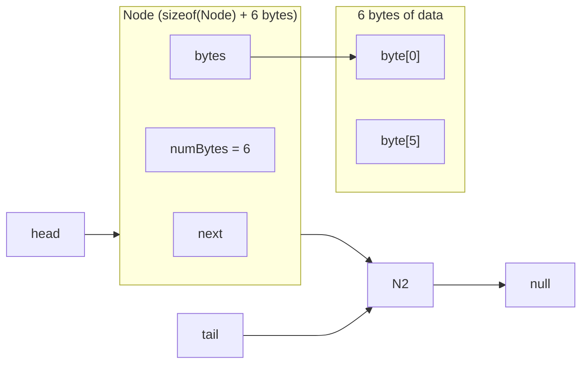

## 1. Which program is fastest? Is it always the fastest?  

`Malloc.cpp` was usually the fastest. `alloca.cpp` was occasionally faster.

## 2. Which program is slowest? Is it always the slowest?  

`list.cpp` is usually, but not always the slowest, sometimes `new.cpp` is slower.

## 3. Was there a trend in program execution time based on the size of data in each Node? If so, what, and why?  

Yes, when I increased the size of each node, the execution time increased, but not by as much as when I increased the length of the block chain.

## 4. Was there a trend in program execution time based on the length of the block chain?  

Yes, as the length of the block chain increased, the program time significantly increased.

## 5. Consider heap breaks, what's noticeable? Does increasing the stack size affect the heap? Speculate on any similarities and differences in programs?  

Programs that allocate nodes on the heap (`malloc.cpp`, `new.cpp`, and `list.cpp`) require periodic heap growth. In contrast, `alloca.cpp` allocates nodes on the stack and therefore shows little to no heap break activity related to node allocation. Increasing the stack size allows `alloca.cpp` to handle larger lists without crashing but does not affect heap usage in the heap-based programs. This demonstrates that stack and heap memory are separate and grow independently, with allocator behavior accounting for differences among heap-based implementations.

## 6. Considering either the malloc.cpp or alloca.cpp versions of the program, generate a diagram showing two Nodes. Include in the diagram  

   - the relationship of the head, tail, and Node next pointers.  
   - show the size (in bytes) and structure of a Node that allocated six bytes of data  
   - include the bytes pointer, and indicate using an arrow which byte in the allocated memory it points to.  

## 7. There's an overhead to allocating memory, initializing it, and eventually processing (in our case, hashing it). For each program, were any of these tasks the same? Which one(s) were different?  

Across all four programs, the initialization and hashing work are essentially the same: each node ends up with `numBytes` bytes filled with predictable values, and the hash function iterates over exactly those bytes, so the total number of bytes processed and the hashing logic are comparable for the same `NUM_BLOCKS`, `MIN_BYTES`, and `MAX_BYTES`.

## 8. As the size of data in a Node increases, does the significance of allocating the node increase or decrease?

The significance of node allocation decreases as the node’s data size increases. As `MIN_BYTES`/`MAX_BYTES` increases, the node allocation method becomes less important relative to the total runtime.

Evidence from my trials (`NUM_BLOCKS=1,000,000`, `OPT="-O2 -g2"`):

- 10 bytes/node: large separation  
  `alloca` avg 0.095s vs `list` avg 0.194s (about 2× slower)

- 100 bytes/node: smaller separation  
  `alloca` avg 0.442s vs `list` avg 0.555s (~1.26× slower)

- 1000 bytes/node: results are very close  
  `alloca` avg 3.960s, `malloc` avg 3.842s, `list` avg 3.943s, `new` avg 3.989s (all within a narrow band)

As node payload grows, the cost of allocating nodes becomes less significant because hashing and processing the data dominate runtime.
