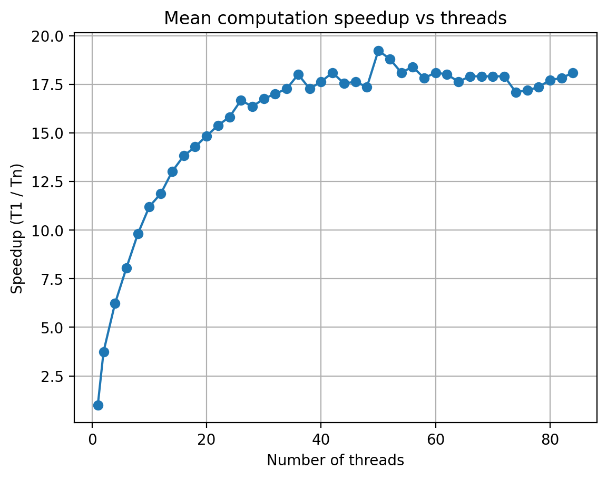
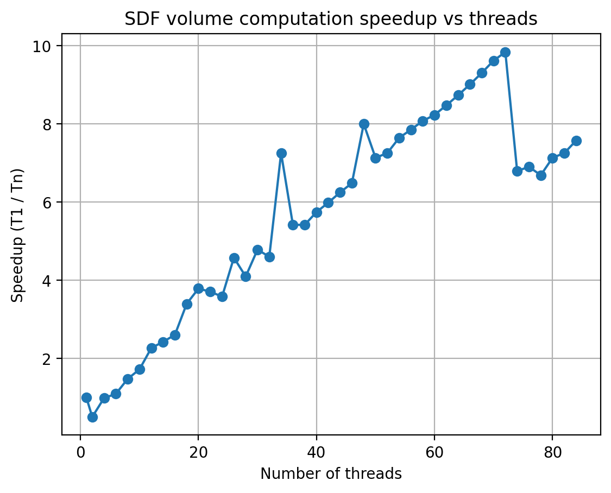

## “Computing a Mean” Questions

There is a logarithmic trend to the data, and it looks like the most efficient number of threads to use for this was 36.

## “Computing a Volume” Questions

As opposed to the mean speedup, this graph appears to be linear.
